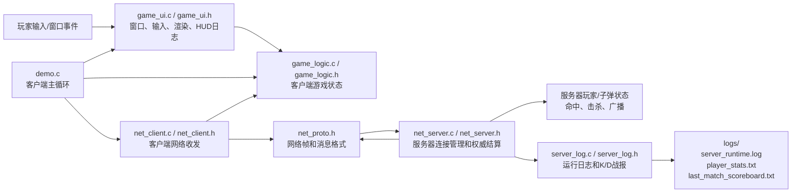

# 系统需求：
本项目旨在构建多人联机的娱乐射击对战系统。
# 系统约束：
1.必须预装vnt虚拟内网组件工具，装箱效果一般。
2.目前仅仅支持最多5人玩家。且系统并发性能弱。

# 系统概述
## 服务器端：
1.创建监听套接字，接受加入房间的玩家数据并转发给房间中的其他玩家。
2.计算子弹位置并与玩家位置比较，统一击杀检测。
## 客户端
1.接收服务器数据包，渲染数据包中其他玩家的信息和本地玩家信息。
2.检测键盘事件，`WASD`移动位置，`SPACE`实现隐身，鼠标左键发射子弹。
3.打包数据发送给服务器。

# 开发中遇到的问题
## 1 客户端收到一堆数据包，怎么分类？玩家断联id又该如何分配？
在代码层面，对于每个连接，只能获取套接字值（SOCKET 本质INT）来区别不同的数据包分别来自哪台主机。为解决数据包归属问题，服务器端设计了socket2id[] 和id2socket[]列表数据结构，实现<SOCKET,ID>的双向映射，同时也考虑了ID动态分配的问题（新加入房间的玩家分配什么ID,退出房间的玩家数据怎么去除）

```C
//连接建立时：
    int found_id = -1;
    for (int loop = 0; loop < MAX_CLIENTS; loop++)
    {
        point = (point + 1) % MAX_CLIENTS;  // 循环+1
        if (id2socket[point] == INVALID_SOCKET)
        {
            found_id = point;
            break;
        }
    }
    // 分配成功
    id2socket[found_id] = new_sock;
    socket2id[new_sock] = found_id;
    // 添加到客户端列表
    clients[client_count++] = new_sock;
    printf("New client connected! ID = %d\n", found_id);
    fflush(stdout);
//客户端：
    g_state.remote_players[id].x = out_packet->x;
    g_state.remote_players[id].y = out_packet->y;
    g_state.remote_players[id].invisible = out_packet->invisible;
//断联时
    id2socket[die_id] = INVALID_SOCKET;
    socket2id[s] = -1;
    closesocket(s);
// 从客户端数组移除
for (int j = i; j < client_count - 1; j++)
    clients[j] = clients[j + 1];
    client_count--;
    i--;
    continue;
```
## 2 数据包粘包问题。
TCP是流式协议，一开始不做缓冲区截断读取，收到的数据包和读取的数据包都不完整，导致玩家出现位置频闪

## 3 何时结算游戏状态的问题
摒弃了一开始收齐信息再发的方案，选用server_tick方案，服务器每30ms tick一下，结算游戏全局状态。

## 4 游戏结束本地化对局数据的设计方案
由于之前的主机关机都是控制台Ctrl+C强制结束进程,在避免重复无效写入的情况下,服务器无法得知何时适合写入终局数据.为此考虑了神奇的SetConsoleCtrlHandler函数来执行本地化函数


# 系统功能模块划分

## 模块关系图



## 按文件划分

| 文件 | 模块 | 主要功能 |
| --- | --- | --- |
| `src/demo.c` | 客户端入口/主循环 | 初始化游戏状态、创建窗口、连接服务器；每帧处理输入、发送玩家状态、接收服务器状态、更新本地表现并渲染画面。 |
| `src/game_ui.c` / `include/game_ui.h` | 客户端UI与输入模块 | 基于 Win32 创建游戏窗口；处理键盘、鼠标事件；维护开火事件、鼠标坐标、网络调试日志；绘制玩家、子弹、HUD 和日志文本。 |
| `src/game_logic.c` / `include/game_logic.h` | 客户端游戏状态模块 | 定义并维护 `GameState`、`Player`、`Bullet`、`RemoteBullet`；保存本地玩家、远程玩家和远程子弹；提供移动、隐身、子弹 upsert、状态查询等接口。 |
| `src/net_client.c` / `include/net_client.h` | 客户端网络模块 | 使用 WinSock 连接服务器；把本地玩家输入打包为 `NetClientInput` 发送；接收服务器的玩家/子弹状态并同步到 `GameState`。 |
| `include/net_proto.h` | 网络协议模块 | 定义 TCP 帧头 `NetFrameHeader`、消息类型、输入包、玩家状态包、子弹状态包；提供 `net_wire_send_framed` 等按帧发送工具，解决 TCP 粘包/半包问题。 |
| `src/net_server.c` / `include/net_server.h` | 服务器核心模块 | 创建监听 socket；分配玩家 ID；维护 `id2socket`、`socket2id`、客户端列表；解析客户端输入；统一更新玩家、子弹、命中、击杀和死亡；广播权威状态。 |
| `src/server_log.c` / `include/server_log.h` | 服务器日志模块 | 记录服务器启动、玩家加入/离开、击杀事件；使用 `SetConsoleCtrlHandler` 在 Ctrl+C 或关闭控制台时保存对局结果；用 `fscanf/fprintf` 读写累计 K/D 和本局战报。 |

## 数据流说明

客户端侧的数据流是：`game_ui.c` 收集输入，`demo.c` 每帧调用 `net_client.c` 发送输入包，服务器返回状态后由 `net_client.c` 写入 `game_logic.c` 中的 `GameState`，最后 `game_ui.c` 从 `GameState` 读取数据并绘制。

服务器侧的数据流是：`net_server.c` 接收所有客户端输入，将输入应用到服务器保存的 `ServerPlayer` 和 `ServerBullet`，由服务器统一判断子弹移动、命中、击杀和复活，再把权威状态广播给客户端。服务器退出时，`server_log.c` 根据 `ServerPlayer.kills/deaths` 生成纯文本 K/D 战报。

## 日志输出文件

| 文件 | 内容 |
| --- | --- |
| `logs/server_runtime.log` | 服务器运行日志，包括启动、玩家加入、玩家离开、击杀事件、保存对局等。 |
| `logs/player_stats.txt` | 玩家累计数据，格式为 `id total_kills total_deaths matches`，方便用 `fscanf` 读取。 |
| `logs/last_match_scoreboard.txt` | 最近一局的纯文本 K/D 排行榜，包含玩家 ID、在线状态、Kills、Deaths、K/D 和击杀压力条。 |
